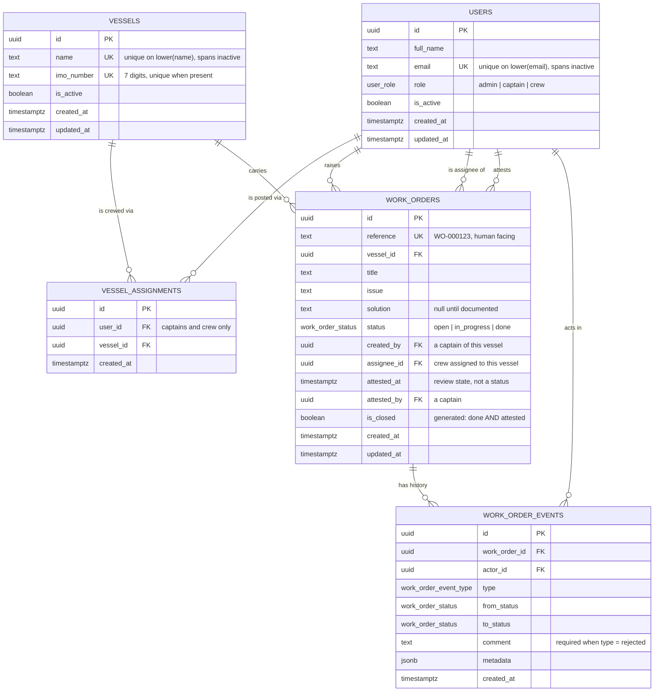

# Seafair — Marine Work Order Management

Vessel-scoped work orders for a marine fleet. Captains raise work against a vessel and
assign it to crew; crew document and complete it; captains attest or reject. Admins
manage the fleet, its people, and who sails on what.

- **Live:** _(deployment URL)_
- **Stack:** Next.js 16 (App Router) · TypeScript (strict) · Supabase/Postgres · Tailwind 4 · shadcn/ui · TanStack Query

---

## Sixty-second review

The three dropdowns at the top are the mock authentication. Vessel narrows the roster,
role narrows it further, and choosing a member switches the entire session to that
person.

1. **Pick vessel `Northern Star`, then member `Ada Harbour` (Admin).**
   You get the whole fleet — 5,000+ work orders — plus Users, Vessels and Assignments.
2. **Switch to a captain of Northern Star** (`Dmitri Karlsen` or `Lena Sato`).
   Admin tabs vanish. Five hand-placed work orders show every state at once:
   `WO-000001` Open · `WO-000002` In Progress · `WO-000003` Awaiting attestation ·
   `WO-000004` rejected twice, with the reasons in its timeline · `WO-000005` Attested.
3. **Open `WO-000003` and Attest or Reject it.** Reject requires a reason and returns
   the work to the crew as In Progress. Open `WO-000004` to read a real rejection history.
4. **Switch to the crew member named on `WO-000001`.** They see only their own work —
   not their shipmates'. They can start it, document a solution, and mark it done, but
   cannot attest their own work.
5. **Switch back to `Ada Harbour` and try to deactivate a crew member holding open work**
   (Users → Deactivate). The database refuses and names the obstacle. Reassign the work
   first and it succeeds.

Two things worth trying because they show the enforcement is real, not cosmetic:

- **Attest as an Admin.** You cannot — and the control says why. See
  [ADR 0002](docs/adr/0002-admins-do-not-attest.md).
- **Query the API directly with the public key.** It returns `401`. The `anon` role holds
  zero privileges on every table.

---

## The design decision that matters

The brief asks for three things that pull against each other: browser-side Supabase reads
and writes, *no* Supabase Email Auth, and a database graded on "RLS policies… proper
authorization checks."

A browser client holding only the public `anon` key has no `auth.uid()`. Every RLS policy
you could write therefore degenerates to `USING (true)` — which grants the entire database
to anyone holding a key that is, by design, public. RLS that is secretly `true` is not
security; it is decoration.

**Seafair mints its own session token instead.** `POST /api/session` takes a member id,
confirms that member is active, and signs a short-lived JWT. The browser client attaches
it through supabase-js's `accessToken` option, so `auth.uid()` is *real inside Postgres*
and RLS performs the actual authorization — while every read and write still travels
browser → Supabase, as the brief prefers.

Impersonation is deliberately unauthenticated. That **is** the mock auth we were asked to
build. What matters is that the mock stops at *identity*; every question of *authority* is
answered by the database.

This was verified against the live project, not assumed — `pnpm db:verify` mints a token,
calls the REST API, and asserts that the gateway accepts it, that RLS resolves the
identity, and that a member of another vessel receives an empty result:

```
anon key only     -> 401
minted (captain)  -> 200  [{"reference":"WO-000001"}]
minted (outsider) -> 200  []
```

Full reasoning in [ADR 0001](docs/adr/0001-server-minted-jwt-for-mock-auth.md).

---

## Entity relationship diagram



### Two modelling choices worth explaining

**Attestation is not a status.** The brief requires statuses to be *strictly*
`Open | In Progress | Done`, yet also requires Attest and Reject. So review state cannot
live in `status` — it lives on `attested_at` / `attested_by`. `Done` + unattested means
"awaiting the captain"; `Done` + attested is Closed, the only terminal condition. A
generated column `is_closed` stores that so guards and filters hit an index.

**`Assignment` and `Assignee` are different relations.** An Assignment places a person
aboard a vessel. An Assignee is the one crew member responsible for a work order. Naming
both "assignment" would leave every future reader guessing. See [CONTEXT.md](CONTEXT.md)
for the full glossary.

---

## Where authorization actually lives

Nothing below is enforced in React. The client hides controls people cannot use, but that
is courtesy — every rule holds against `curl`.

### Table privileges

| Table | `anon` | `authenticated` |
|---|---|---|
| `users` | — | `SELECT`, `INSERT`, `UPDATE` (RLS narrows to admins for writes) |
| `vessels` | — | `SELECT`, `INSERT`, `UPDATE` (same) |
| `vessel_assignments` | — | `SELECT`, `INSERT`, `DELETE` (same) |
| `work_orders` | — | `SELECT` **only** |
| `work_order_events` | — | `SELECT` **only** |

`anon` holds **no privilege on anything**. The utility bar's roster is served by
`GET /api/roster`, which returns only `{id, full_name, role, vessel_ids}` — no emails.

### Read visibility (RLS)

| | Admin | Captain | Crew |
|---|---|---|---|
| `users` | all | self + shipmates | self + shipmates |
| `vessels` | all | assigned only | assigned only |
| `vessel_assignments` | all | own + own vessels' | own + own vessels' |
| `work_orders` | all | all aboard assigned vessels | **only their own** |
| `work_order_events` | follows the work order it belongs to | | |

### Write operations

`work_orders` has **no write grant for anyone**. Every mutation is a `SECURITY DEFINER`
function called from the browser via `supabase.rpc()`.

| Operation | Admin | Captain | Crew |
|---|---|---|---|
| `create_work_order` | ✗ | ✓ own vessel | ✗ |
| `start_work_order` | ✗ | ✗ | ✓ if assignee |
| `save_solution` | ✗ | ✗ | ✓ if assignee, not while under review |
| `complete_work_order` | ✗ | ✗ | ✓ if assignee, solution required |
| `attest_work_order` | ✗ | ✓ own vessel | ✗ |
| `reject_work_order` | ✗ | ✓ own vessel, reason required | ✗ |
| `reassign_work_order` | ✓ | ✓ own vessel | ✗ |

RLS constrains *rows*; these rules constrain *columns* — crew may write `solution` but
never `assignee_id`. A blanket `UPDATE` grant cannot express that, and a mandatory
rejection reason has nowhere to live in a plain table update.
See [ADR 0004](docs/adr/0004-lifecycle-mutations-are-database-functions.md).

### Rules the database refuses to break

Constraints and triggers, not application code:

- No transition to `Done` without a Solution.
- No rejection event without a comment.
- Only legal transitions: `Open→In Progress→Done`, and `Done→In Progress` on rejection.
- A Closed work order is frozen; attestation cannot be withdrawn.
- A work order cannot move between vessels.
- Emails and vessel names are unique **including against deactivated rows** — the remedy
  for wanting a name back is reactivation, never a duplicate.
- Admins cannot be assigned to a vessel.
- **Deactivation guards** (`R1`–`R6`): crew holding open work cannot be deactivated,
  unassigned, or converted to another role; the last active captain of a vessel with open
  work cannot be deactivated, demoted, or unassigned; the last active admin cannot be
  deactivated or demoted; a vessel with open work cannot be deactivated.

Every one raises a named error (`SF001`–`SF029`) that the UI maps to a readable message.

### SQL injection

There is no string-built SQL anywhere. The browser talks to PostgREST, which parameterises
everything; scripts use parameterised `pg` queries; and every `SECURITY DEFINER` function
sets an explicit `search_path`.

---

## Performance

Seeded with **5,005 work orders** so the numbers mean something.

The first version was slow for an instructive reason. Policies called
`app.has_vessel_access(work_orders.vessel_id)` — and passing a *column* makes the call
correlated, so Postgres cannot hoist it into an InitPlan the way it does for zero-argument
helpers. `EXPLAIN` showed it running once per candidate row. Wrapping calls in
`(select ...)`, the usual advice, does not help in the correlated case.

Resolving the caller's reachable vessel ids once into an array and testing rows with
`= any(...)` makes the whole predicate a single InitPlan:

| | before | after |
|---|---|---|
| Execution time | 91.4 ms | **1.21 ms** |
| Shared buffers | 3,081 | **76** |
| Plan | Bitmap scan + sort, `SubPlan loops=715` | Index scan, all InitPlans |
| First page over HTTPS | 761 ms | **109 ms** |

A test asserts the plan contains no `SubPlan` and no node looping more than once, so this
cannot quietly return. Reproduce with `pnpm db:perf`.

Also: **cursor pagination** on `(created_at desc, id desc)`, not `OFFSET` — offset
re-scans what it skips and shifts rows under the reader when work is raised mid-scroll.
Dashboard tallies are one grouped RPC rather than five queries.

---

## Tests

59 tests against a **project-local Postgres** (`embedded-postgres`) — no Supabase project,
no network, no fixtures to maintain:

```bash
pnpm test
```

They cover all six deactivation guards, duplicate keys across inactive rows, both CHECK
constraints, illegal transitions, the full lifecycle across four actors, repeated
rejections, and — most importantly — that **a crew member holding a valid token cannot
read another vessel's work orders**.

This is possible because the migrations depend only on `current_setting()` and the
`anon`/`authenticated` roles, with nothing Supabase-specific. Worth keeping true.

---

## Running it

```bash
pnpm install
cp .env.example .env.local     # fill in from your Supabase project
pnpm db:migrate                # apply migrations
pnpm db:seed                   # showcase fixtures + 5,000 work orders
pnpm dev
```

| Script | Purpose |
|---|---|
| `pnpm test` | Full suite against a local throwaway Postgres |
| `pnpm db:migrate` | Apply pending migrations |
| `pnpm db:reset` | Drop and rebuild the schema, then migrate |
| `pnpm db:seed` | Reseed the fleet |
| `pnpm db:verify` | Prove the token path still works against live |
| `pnpm db:perf` | Query plans and latency at volume |
| `pnpm db:schema` | Regenerate `schema.sql` from the migrations |

### Configuration notes

Use the **Legacy API Keys** (`anon` / `service_role`, both starting `eyJ`) rather than the
newer `sb_publishable_` pair. The impersonation token is signed with the project's
symmetric JWT secret, and the legacy keys belong to that same regime. Legacy keys are
deprecated at the end of 2026; if they are withdrawn, only `app.current_user_id()` needs
to change — see the fallback noted in ADR 0001.

`SUPABASE_DB_PASSWORD` is preferred over `DATABASE_URL`: Supabase passwords routinely
contain `@`, `#` and `%`, all of which are structural inside a connection URI, and `#` is
additionally eaten by dotenv's comment handling.

---

## Layout

```
src/
├── app/
│   ├── api/session/         # mints the impersonation token
│   ├── api/roster/          # the pre-session roster; keeps anon at zero privilege
│   ├── admin/               # users, vessels, assignments
│   └── work-orders/[id]/    # detail with activity timeline
├── components/
│   ├── layout/              # utility bar (the three dropdowns), nav
│   ├── work-orders/         # list, actions, timeline, status
│   └── admin/               # guard and shell
└── lib/
    ├── domain/types.ts      # vocabulary, mirrors CONTEXT.md
    ├── queries/             # TanStack Query hooks over the browser client
    ├── session/             # session context and token minting
    └── errors.ts            # SF#### codes -> readable messages

supabase/migrations/         # the source of truth for the database
schema.sql                   # generated from the above
docs/adr/                    # decisions a reader would otherwise question
CONTEXT.md                   # the glossary
```

## Decisions

- [0001 — Server-minted JWTs carry the mock session, so RLS does the real enforcement](docs/adr/0001-server-minted-jwt-for-mock-auth.md)
- [0002 — Admins manage the fleet but take no part in the work order lifecycle](docs/adr/0002-admins-do-not-attest.md)
- [0003 — Work order status is a stored column, not a fold over the event log](docs/adr/0003-status-is-stored-not-derived.md)
- [0004 — Work order mutations are database functions, not table writes](docs/adr/0004-lifecycle-mutations-are-database-functions.md)

## Known limitations

- **Realtime is not wired up.** Switching member invalidates the cache, but two browsers
  watching the same work order will not update each other live. Deliberate: the
  subscription lifecycle interacts awkwardly with identity switching.
- **The mobile layout is unverified by eye.** The list swaps from table to cards below
  `md`, and it builds, but browser resizing did not work in the environment used to
  develop it.
- **No UI component tests.** Testing effort went to the database instead, where the
  guarantees are.
